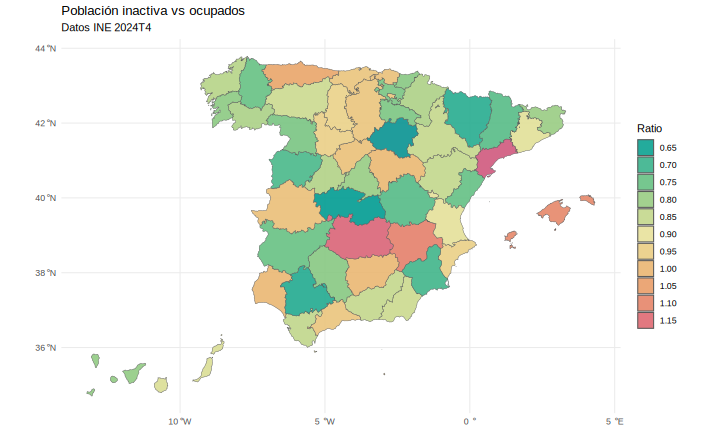
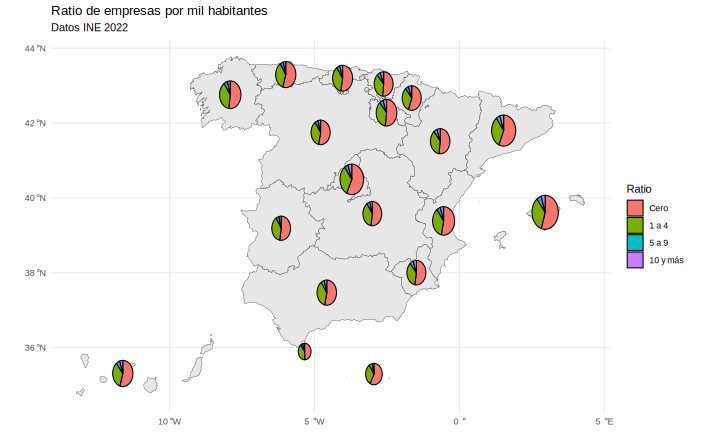
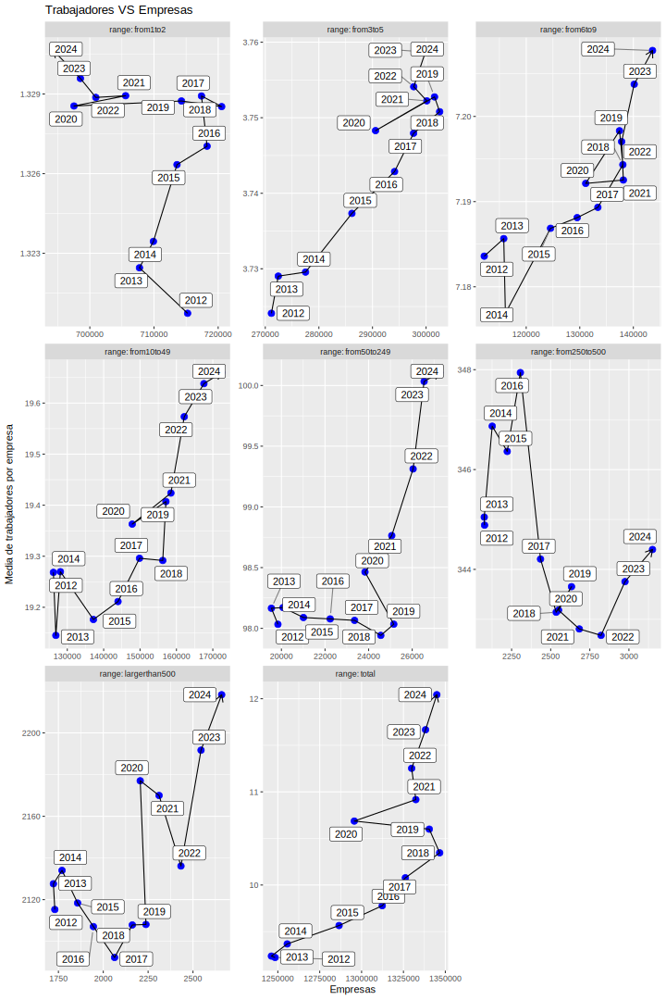

# Técnica Grupo I - Choropleth Map

## Descripción

Creado por Charles Dupin en 1826 para ilustrar la alfabetización en Francia por provincias; 
muestra áreas geográficas divididas en regiones que están coloreadas, 
uniendo datos espaciales y datos estadísticos que representan la variable estudiada agregada en cada región.

Entre sus beneficios se encuentran:
* Destacar patrones espaciales
* Facilitar comparaciones
* Integrar datos de diferentes fuentes
* Adaptar la visualización a diferentes nivels geográficos

Entre sus limitaciones destaca no poder comparar con exactitud los valores o que las regiones más grandes aparezcan más enfatizadas.
Es importante procesar los datos y normalizarlos para producir mapas de densidad ya que no tiene sentido comparar directamente valores absolutos entre áreas de diferente tamaño o población.
También es crítico utilizar una paleta de colores continuos, poner una leyenda e incluso usar mapas con hexbin (celdas exagonales) si hay regiones de tamaños muy dispares.

## Datos de entrada

* Variable espacial con las diferentes regiones y sus limites
* Variable numérica para determinar el color de cada región del mapa

## Datos seleccionados

El objetivo es determinar la importancia de las personas inactivas en las diferentes provincias de España. Teniendo en cuenta la diferencia tanto en tamaño como en población, normalizaremos el dato con la población ocupada de cada provincia.
La fuente de los datos es el Instituto Nacionalde Estadística:

* Por provincias, inactivos: https://www.ine.es/dynt3/inebase/index.htm?padre=10918&capsel=10922
* Por provincias, ocupados: https://www.ine.es/jaxiT3/Datos.htm?t=65354

El dataset contiene para cada provincia y trimestre dentro del rango de años seleccionado el número de personas inactivas y de personas ocupadas.

## Representación

Hemos utilizado la escala de colores hcl.colors Temps para expresar el ratio entre inactivos y ocupados,
con un color más rojizo a medida que aumenta el valor.
Si consideramos que las personas ocupadas producen los recursos que mantienten a las demás,
esta visualización nos ayuda a identificar zonas donde esto puede resultar una carga mayor y donde pueden ser necesarias políticas específicas.

# Técnica Grupo II - Proportional Symbol Map

## Descripción

Se atribuye a Henry Drury el primer mapa que intenta representar puntos proporcionales en un mapa de 1838 del tráfico de crarga en Irlanda. El Censo de Gran Bretaña de 1851 incluye mapas donde las ciudades tiene un tamaño proporcional a su población.
En algunos casos se aumenta el número de variables utilizando un símbolo de tipo tarta, donde el tamaño muestra un valor total y los segmentos las partes que lo forman.

Entre sus limitaciones destacan el tamaño mínimo o máximo del conjunto de datos,
los requisitos sobre el diseño del símbolo para que se pueda apreciar el tamaño, comparar con los demás símbolos e identificar fácilmente las formas, y el hecho de no poder mostrar valores negativos o variables categóricas.

Debido a esto se considera que sólo las variables de tipo ratio son apropiadas para este tipo de representación.

https://en.wikipedia.org/wiki/Proportional_symbol_map#:~:text=A%20proportional%20symbol%20map%20or,to%20represent%20a%20quantitative%20variable.

## Datos de entrada

* Variable espacial con los puntos a representar
* Variable numérica para determinar el tamaño del símbolo de cada punto. También pueden ser varias variables que sumadas formen un total y puedan representarse como tarta (porciones)

## Datos seleccionados

Se ha seleccionado el stock de empresas y estrato de asalariados de Año 2022, publicado por el INE.

El objetivo es comparar las CCAA tanto por el número de empresas como por el peso de las microempresas dentro de éste:

El dataset contiene el número de empresas por CCAA segementadas según el número de empleados: Cero, 1 a 4, 5 a 9, 10 y más
Para normalizar los datos y determinar el tamaño del símbolo tarta utilizaremos el ratio entre el número de empresas y la población de la CCAA (miles) de forma que el ratio indique también el nivel de emprendeduría de la zona.

* https://www.ine.es/jaxi/Tabla.htm?tpx=71095&L=0
* https://www.ine.es/jaxiT3/Tabla.htm?t=67988
* https://www.ine.es/jaxiT3/Datos.htm?t=67988

## Representación

En este caso hemos superpuesto sobre el mapa el símbolo de tarta con tamaño según el ratio entre empresas y habitantes y composición según el número de empleados
Se puede apreciar que las tartas en Madrid, Catalunya y Baleares son mayores que en el resto; en estas comunidades hay un ratio de empresas superior.
Aunque es difícil apreciar los tamaños exactos de cada porción de cada símbolo, sí se puede apreciar que las empresas con menos de 5 empleados son abrumadora mayoría en todas las comunidades.

# Técnica Grupo III - Connected Scatterplots

## Descripción

Hay diagramas de puntos dispersos conectados desde 1790, cuando se representaba el ciclo de pistones de máquinas de vapor. Se ha utilizado frecuentemente para ilustrar la evolución temporal de variables como el desempleo, como en un diagrama de líneas.
Existe un segundo tipo que representa la relación entre dos variables numéricas a lo largo del tiempo.

http://steveharoz.com/research/connected_scatterplot/#:~:text=As%20far%20back%20as%20the,to%20convey%20information%20to%20readers.
https://en.wikipedia.org/wiki/Proportional_symbol_map#:~:text=A%20proportional%20symbol%20map%20or,to%20represent%20a%20quantitative%20variable.

Esta visualización tiene limitaciones respecto otra visualizaciones más simples:
* Los lectores esperan que el tiempo fluya hacia la derecha y esto no tiene porqué cumplirse
* La correlación se expresa mediante una diagonal y no por líneas paralelas, por lo que no es tan evidente
* Pueden aparecer nuevos patrones (como bucles en los datos)

## Datos de entrada

* Variable temporal
* Una o dos variables numéricas (en caso que representar la relación entre ambas variables)

## Datos seleccionados

Hemos utilizado la estadística de Empresas Inscritas en la Seguridad Social, concretamente el número de empresas y el número de trabajadores por tamaño de empresa, desde 2012 a 2024, con los segmentos:
* 1 a 2 trabajadores
* 3 a 5 trabajadores
* 6 a 9 trabajadores
* 10 a 49 trabajadores
* 50 a 249 trabajadores
* 250 a 499 trabajadores
* más de 500 trabajadores

* https://www.mites.gob.es/es/estadisticas/mercado_trabajo/EMP/welcome.htm#

Nos interesa contestar a la pregunta de cómo contribuye al crecimiento del empleo el número de empresas y su tamaño. Para esto representaremos en un diagrama de puntos dispersos el número de empresas y su tamaño medio para cada segmento.

## Representación

La visualización muestra una rejilla con el diagrama de puntos conectados para cada tamaño de empresa. Cada punto tiene una etiqueta indicando el año al que corresponde, de forma que podemos seguir la evolución.
Mediante este gráfico se puede ver que los rangos de empresas pequeñas crecen en ocupación aumentando el número de empresas más que el ratio de empleados por empresa, mientras que en empresas grandes se pueden apreciar los dos comportamientos, crecimiento en tamaño y en número.

# Referencias

https://adrian-cidre.com/posts/001_population_spain_map/
https://ropenspain.github.io/mapSpain/articles/x02_mapasesp.html
https://r-spatial.github.io/sf/#installing
https://colorspace.r-forge.r-project.org/articles/ggplot2_color_scales.html
https://spectdata.com/index.php/2018/10/25/how-to-use-ggplot-to-plot-pie-charts-on-a-map/
https://rpubs.com/Data_Artifex/1114554
https://www.rdocumentation.org/packages/scatterpie/versions/0.1.8/topics/geom_scatterpie
https://cran.r-project.org/web/packages/scatterpie/vignettes/scatterpie.html
https://r-graph-gallery.com/connected_scatterplot_ggplot2.html
